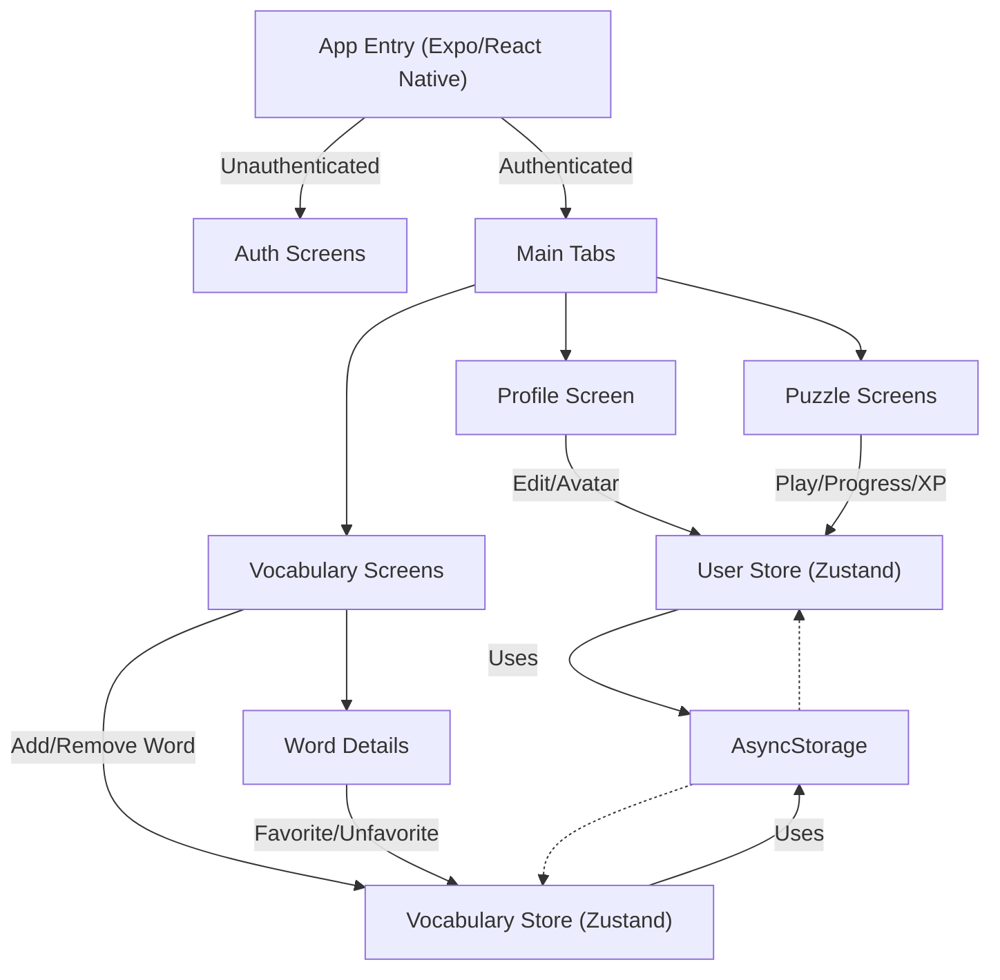

# Wordplay App: Comprehensive Documentation

## Table of Contents

1. [Introduction](#introduction)
2. [Project Structure Overview](#project-structure-overview)
3. [Prerequisites](#prerequisites)
4. [Setting Up the Project](#setting-up-the-project)
5. [Running the App Locally](#running-the-app-locally)
6. [Codebase Walkthrough](#codebase-walkthrough)
7. [Global State Management](#global-state-management)
8. [App Architecture Diagram](#app-architecture-diagram)
9. [Building the APK with EAS CLI](#building-the-apk-with-eas-cli)
10. [Useful Tips & Resources](#useful-tips--resources)

---

## Introduction

**Wordplay** is a vocabulary puzzle app built with [React Native](https://reactnative.dev/) using the [Expo](https://expo.dev/) framework. It features user authentication, profile management, vocabulary games, and real-time updates across screens.

---

## Project Structure Overview

```
wordplay/
├── app/                # Main app screens and navigation
│   ├── (auth)/         # Authentication screens (sign-in, sign-up, etc.)
│   ├── (tabs)/         # Main tab screens (profile, puzzle, vocabulary)
│   └── ...             # Layouts, modals, etc.
├── components/         # Reusable UI components
├── utils/              # Utility functions (auth, progress, vocabulary)
├── types/              # TypeScript type definitions
├── assets/             # Images, fonts, etc.
├── data/               # Static data (e.g., word details)
├── config/             # Configuration files (e.g., Firebase)
├── package.json        # Project dependencies and scripts
├── app.json            # Expo app configuration
└── ...                 # Other config files
```

---

## Prerequisites

- **Node.js** (v16 or later): [Download here](https://nodejs.org/)
- **npm** (comes with Node.js)
- **Git** (for version control): [Download here](https://git-scm.com/)
- **Expo CLI**: Install globally with  
  `npm install -g expo-cli`
- **EAS CLI** (for building APKs):  
  `npm install -g eas-cli`
- **A code editor** (e.g., [VS Code](https://code.visualstudio.com/))

---

## Setting Up the Project

1. **Clone the Repository**
   ```bash
   git clone <your-repo-url>
   cd wordplay
   ```
2. **Install Dependencies**
   ```bash
   npm install
   ```

---

## Running the App Locally

1. **Start the Expo Development Server**
   ```bash
   npm start
   ```
   or
   ```bash
   expo start
   ```
2. **Open the App**
   - **On your phone:**
     - Install the [Expo Go app](https://expo.dev/client) from the App Store or Google Play.
     - Scan the QR code in your terminal or browser.
   - **On an emulator:**
     - Press `i` for iOS Simulator (Mac only) or `a` for Android Emulator in the Expo terminal.

---

## Codebase Walkthrough

### 1. **Authentication**

- Located in `app/(auth)/`
- Handles sign-in, sign-up, and password reset.
- Uses `utils/authService.ts` for user management (with AsyncStorage).

### 2. **Profile**

- Located in `app/(tabs)/profile.tsx`
- Displays and edits user info and avatar.
- Uses global state (`useUserStore`) for real-time updates.

### 3. **Vocabulary**

- Located in `app/(tabs)/vocabulary/`
- Shows all found words, favorites, and word details.
- Uses `utils/vocabularyService.ts` and global state (`useVocabularyStore`).

### 4. **Puzzle Games**

- Located in `app/(tabs)/puzzle/`
- Three levels: basic, moderate, advanced.
- Each level is a word-finding puzzle with XP and hints.

### 5. **Global State Management**

- Implemented with [Zustand](https://docs.pmnd.rs/zustand/getting-started/introduction).
- Store is defined in `components/ui/gluestack-ui-provider/index.tsx`.
- All screens/components use this store for user, progress, and vocabulary data.

---

## Global State Management

- **Why?**  
  To ensure all screens update instantly when user info, vocabulary, or progress changes.
- **How?**
  - Use `useUserStore` for user and progress.
  - Use `useVocabularyStore` for vocabulary and favorites.
  - Services update both AsyncStorage and the store, so UI is always in sync.

**Example:**

```js
import { useUserStore } from "@/components/ui/gluestack-ui-provider";

const user = useUserStore((state) => state.user);
const setUser = useUserStore((state) => state.setUser);
```

---

## App Architecture Diagram



---

## Building the APK with EAS CLI

1. **Login to Expo**
   ```bash
   eas login
   ```
2. **Configure EAS Build**
   - If you haven't already, run:
     ```bash
     eas build:configure
     ```
   - Follow the prompts (select Android, etc.).
3. **Start the Build**
   ```bash
   eas build -p android --profile preview
   ```
   - For a production-ready APK, use `--profile production`.
4. **Download the APK**
   - After the build completes, you'll get a link in the terminal or on your [Expo dashboard](https://expo.dev/accounts/).
   - Download the APK and install it on your device or share it.

---

## Useful Tips & Resources

- **Expo Documentation:** https://docs.expo.dev/
- **React Native Docs:** https://reactnative.dev/docs/getting-started
- **Zustand Docs:** https://docs.pmnd.rs/zustand/
- **EAS Build Docs:** https://docs.expo.dev/build/introduction/
- **Debugging:** Use the Expo Go app for fast refresh and debugging.
